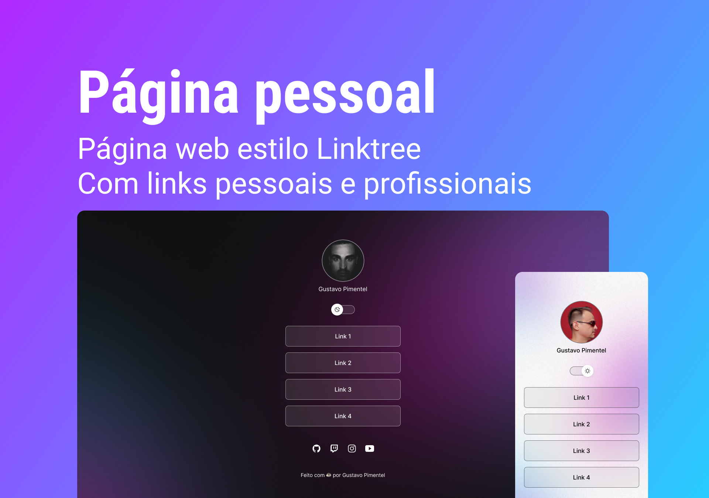

<h1 align="center"> Página Pessoal </h1>

Site pessoal estilo Linktree para ser usado como portfólio e cartão de visita digital.

  <a href="#-tecnologias">Tecnologias</a>&nbsp;&nbsp;&nbsp;|&nbsp;&nbsp;&nbsp;
  <a href="#memo-licença">Licença</a>

  

 

  

## 🚀 Tecnologias

Esse projeto foi desenvolvido com as seguintes tecnologias:

- HTML e CSS
- JavaScript
- Git e Github

## :memo: Licença

Esse projeto está sob a licença MIT.

---

Feito com ☕ por Gustavo Pimentel :wave: [WhatsApp](https://wa.me/5537988122767?text=Ol%C3%A1%2C+Gustavo%21+Vim+pelo+GitHub.)
